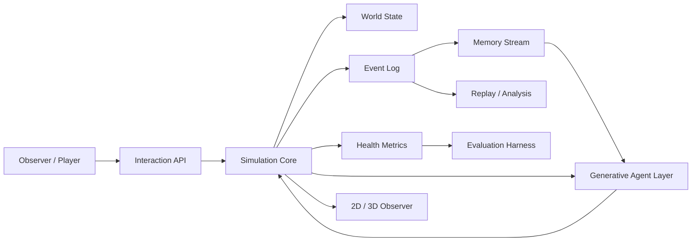

# 系统架构

## 总体结构

## 三层分工

### 1. 世界约束层

由 `Simulation Core` 负责，是唯一世界事实来源。

职责：

- 时间推进。
- 身体需求衰减和恢复。
- 资源生产、搬运、交换和消费。
- 地点状态、路线负载和维护。
- 组织凝聚力、声望和制度压力。
- 干预验证和结算。
- 事件记录、指标输出和回放基础。

这一层必须确定、可测试、可回放。即使 LLM 输出错误，这一层也不能让世界状态失真。

### 2. 生成式 agent 层

由身份、记忆、检索、计划、对话和反思组成。

职责：

- 根据 `AgentProfile` 保持角色连续性。
- 把事件转化为 `MemoryItem`。
- 根据相关性、重要性和近期性检索记忆。
- 生成行动计划、对话、反思或制度提案。
- 把输出交给 Simulation Core 验证。

当前 provider：

- `RuleBasedCognition`: 无 API 的确定性 provider。
- `CodexCliCognition`: 复用本机 Codex CLI 登录状态，用于单次调试。
- `HybridCognition`: 预算、白名单、失败降级。

后续 provider：

- `OpenAICognition`: 真实批量 LLM provider。

### 3. 观察和评估层

职责：

- 展示地点、路线、资源、组织和 agent。
- 支持用户干预。
- 输出 JSON/HTML 报告。
- 记录历史快照。
- 评估社会是否只是“数值稳定”，还是有可解释的社会变化。

## 状态流

1. 世界从 seed 初始化。
2. 每天施加计划中的外部干预。
3. agent 观察世界状态和事件。
4. agent 检索记忆和反思。
5. cognition provider 生成候选计划。
6. Simulation Core 验证计划。
7. 可执行行动改变世界状态。
8. 事件进入日志和 agent 记忆流。
9. 周期性反思写回 agent。
10. 指标、报告和观察器读取状态。

## LLM 边界

LLM 可以输出：

- `Plan`
- 对话片段。
- 反思摘要。
- 组织或制度提案。

LLM 不允许直接输出最终事实：

- 资源最终数量。
- 关系最终分数。
- agent 最终位置。
- 组织是否成立的最终状态。
- 地点是否损坏的最终状态。

这些必须由 Simulation Core 结算。

## 干预协议

用户通过结构化 `Intervention` 进入世界：

- `resource`: 增加或移除资源。
- `disaster`: 制造外部冲击。
- `edict`: 修改世界规则参数。
- `new_agent`: 引入新角色。
- `broadcast`: 发布影响心理和社会氛围的信息。
- `organization`: 创建新组织。

干预会写入事件日志，并可能进入 agent 记忆。

## 当前代码落点

- `virtual_society/model.py`: 世界、agent、组织、地点、计划、记忆数据结构。
- `virtual_society/simulation.py`: 主循环和世界结算。
- `virtual_society/generative_memory.py`: 事件转记忆、检索、反思。
- `virtual_society/cognition.py`: 当前确定性认知 provider。
- `virtual_society/llm_contract.py`: LLM 上下文和结构化计划解析。
- `virtual_society/api.py`: 本地 HTTP API。
- `virtual_society/observer.py`: 2D 观察器。
- `virtual_society/observer3d.py`: Three.js 观察器。
- `virtual_society/reports.py`: JSON/HTML 报告。
