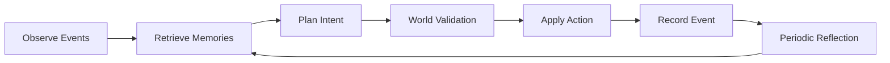

# Generative Agent Architecture

生成式 agent 层的职责是产生“有连续性的社会意图”，不是直接改世界状态。世界状态仍由 Simulation Core 验证和结算。

## 数据结构

### AgentProfile

稳定身份档案：

- `background`: 个人背景。
- `values`: 价值偏好。
- `long_term_goals`: 长期目标。
- `speech_style`: 表达风格。

这些字段进入 LLM 上下文，用来保持角色连续性。

### MemoryItem

结构化记忆：

- `day`: 发生日期。
- `kind`: 事件类型。
- `text`: 事件文本。
- `importance`: 重要性。
- `tags`: 检索标签。
- `actor_id`: 事件发起者。
- `related_agent_ids`: 相关 agent。
- `location_id`: 记忆产生时的位置。

旧的 `memories: list[str]` 暂时保留，用于兼容已有报告和测试。新的 `memory_stream` 是后续 LLM 上下文的主要来源。

## 每日循环

## LLM 边界

LLM 可以生成：

- 行动计划。
- 对话片段。
- 反思摘要。
- 制度或组织提案。

LLM 不能直接生成：

- 资源最终数量。
- agent 位置事实。
- 关系分数最终值。
- 组织是否成立的最终事实。

这些都必须由 Simulation Core 根据结构化意图验证。

## Provider 策略

当前阶段：

- `RuleBasedCognition`: 可重复、无 API、用于长跑测试。
- `CodexCliCognition`: 复用本机 Codex CLI 登录状态，用于单次 debug，不适合批量模拟。
- `OpenAICognition`: OpenAI Responses API provider，使用 JSON schema 约束输出结构；需要 `OPENAI_API_KEY`。
- `HybridCognition`: 预算、白名单、失败降级。

下一阶段：

- prompt 输入输出写入运行记录。
- 加入缓存和批处理。
- 只在反思、对话或关键计划时调用模型，不对每个 tick 的每个 agent 都调用。

## 当前代码落点

- `virtual_society/model.py`: `AgentProfile`、`MemoryItem`、世界状态和规则参数。
- `virtual_society/generative_memory.py`: 事件转记忆、检索、反思。
- `virtual_society/simulation.py`: 主循环、12 人 Alpha 预设、结构化记忆和社交对话。
- `virtual_society/llm_contract.py`: LLM 上下文包含 profile、retrieved memories 和 reflections。
- `virtual_society/openai_provider.py`: OpenAI Responses API provider。
- `virtual_society/social_evaluation.py`: 社会可信度评估。
- `virtual_society/observer.py` 与 `observer3d.py`: 展示目标、计划、反思和世界状态。
